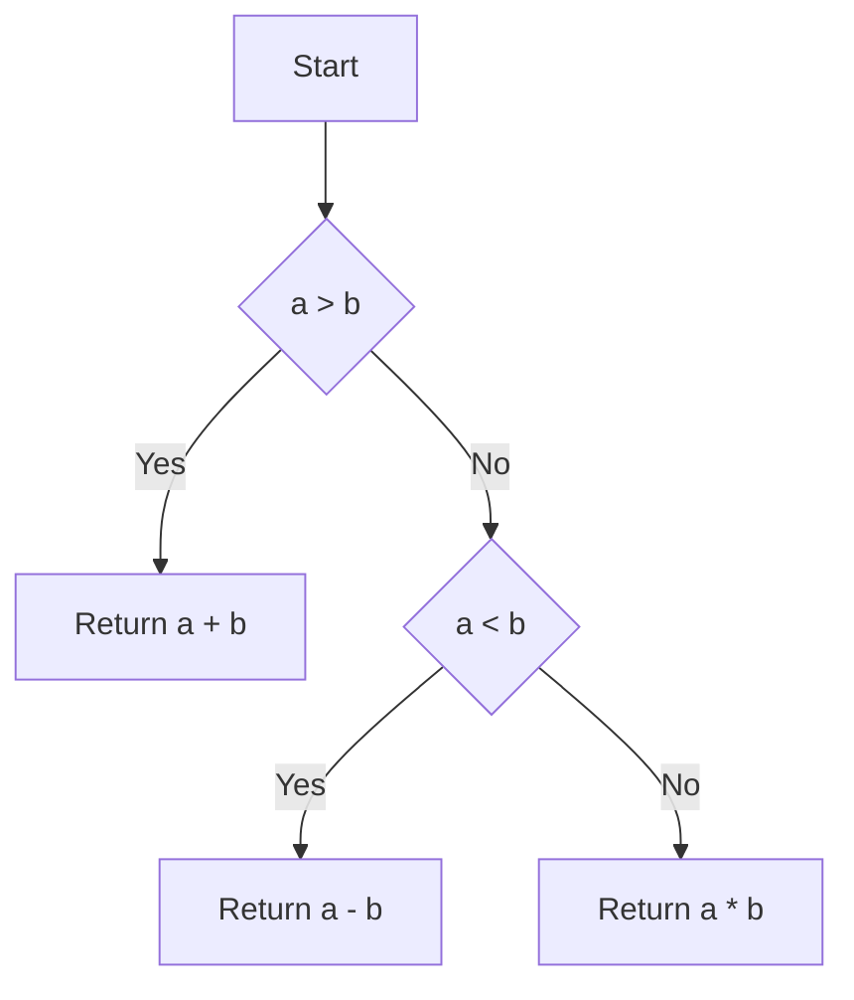

# cyclomatic-complexity-clang-plugin

This repository is a small plugin for clang which can be built and ran to anaylse the cyclomatric complexity of the code

Cyclomatic complexity is a software metric that measures the complexity of a program by counting the number of independent paths through its source code. It provides insights into the potential number of test cases required to achieve full code coverage.

To analyze the cyclomatic complexity of your code using the clang plugin, follow these steps:

1. Build the plugin:

```bash
mkdir build
cd build
cmake ..
make
```

2. Run the plugin on your code:
   The plugin takes a C++ source file as input and generates a report with the cyclomatic complexity values for each function in the code.

This command is run relative to the root of the repository.

- You can change the path to the source file you want to analyze.
- The plugin requires the `-lstdc++` flag to link the C++ standard library.
- The plugin generates a report with the cyclomatic complexity values for each function in the code.
- Stores as `results.cy`.

```bash
clang -lstdc++ -fplugin=./build/libCyclomaticComplexity.so ./test/sample.cpp
```

The plugin will generate a report that includes the cyclomatic complexity values for each function in your code.

Let's take a detailed example to understand how cyclomatic complexity works. Consider the following code snippet:

```cpp
int calculateSum(int a, int b) {
    if (a > b) {
        return a + b;
    } else if (a < b) {
        return a - b;
    } else {
        return a * b;
    }
}
```

In this example, we have a function `calculateSum` that takes two integers as input and returns their sum, difference, or product based on certain conditions.

To calculate the cyclomatic complexity of this function, we count the number of decision points, which include conditional statements (`if`, `else if`, `else`) and loop statements (`for`, `while`, `do-while`). In this case, we have three decision points: the `if` statement, the `else if` statement, and the `else` statement.

The cyclomatic complexity is then calculated using the formula: `M = E - N + 2P`, where:

- `E` is the number of edges in the control flow graph (number of decision points + 1)
- `N` is the number of nodes in the control flow graph (number of statements + 1)
- `P` is the number of connected components (1 for a single function)

For our example, `E = 4`, `N = 5`, and `P = 1`. Therefore, the cyclomatic complexity `M` is `4 - 5 + 2*1 = 1`.

To visualize the control flow graph and understand the paths through the code, you can use markdown graphs. Here's an example of how you can represent the control flow graph for our `calculateSum` function:



This graph shows the different paths that can be taken based on the conditions. By analyzing the cyclomatic complexity and the control flow graph, you can identify potential areas of code that may require additional testing or refactoring to improve code quality.
